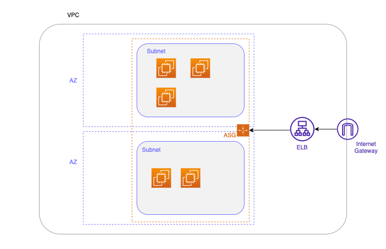

# TerraformChallenge

# Terraform Coding Challenge

Challenge: Deploy a Highly Available Web Application Architecture on AWS

## Challenge

## Objective:

Design a Terraform script to deploy a simple, highly available web application architecture on AWS. The architecture should include the following components:

1. VPC with at least two public subnets in different Availability Zones (AZs) to ensure high availability.
2. EC2 Instances to host the web application, distributed across the two public subnets.
3. An Application Load Balancer (ALB) to distribute traffic to the EC2 instances.
4. A Security Group for the ALB allowing traffic on port 80 and another for the EC2 instances allowing traffic from the ALB.
5. Auto Scaling Group that spans the two public subnets to ensure that the desired number of EC2 instances is maintained.
6. S3 Bucket for storing web application logs.

## Requirements:

- Use AWS as the provider.
- The web application does not need to be deployed; you can assume a placeholder HTML file.
- Use variables for configurable parameters (e.g., region, instance type).
- Ensure resources are tagged appropriately with at least "Name" and "Environment" tags.

## Architecture Diagram
Create an architecture Diagram like the folowing, showing your solution

## Deliverable:

A Terraform script that can be executed to create the described infrastructure from scratch.

## Instructions:
* Fork this repository and modify the code.  Create a pull request to this reposity when you are ready.
* The current code is set up as a example, but is not is a working state. You can fix it or create your own as needed.
* Focus on best practices.

